# Vocalyze — AI-Powered Employee Feedback & Insights

> **Every voice heard. Every theme acted on.**  
> An enterprise-grade, anonymous-by-design employee voice platform that bridges the gap between frontline workers and leadership using multimodal capture, AI-driven risk radar, semantic search, and closed-loop accountability.

[](https://nextjs.org/)
[](https://react.dev/)
[](https://www.typescriptlang.org/)
[](https://tailwindcss.com/)
[](https://supabase.com/)
[](https://ai.google.dev/)

---

## Overview

### The Problem
Traditional employee feedback systems fail where they matter most:
- **Disengagement & Silence:** Only 20% of employees worldwide are engaged—costing \$10 trillion annually in lost productivity. In a classic organizational silence study, 85% of workers held back critical concerns from leadership, with 46% citing fear of retaliation.
- **The Frontline Disconnect:** 80% of the global workforce (~2.7 billion people) is deskless. In multilingual markets such as India (with 121 languages and 22 scheduled languages), rigid English-only web surveys leave non-desk workers completely unheard.
- **The Broken Feedback Loop:** Only one-third of employees believe their employer acts on feedback. Critical issues like harassment, hazardous working conditions, or severe burnout sit unnoticed in spreadsheets until an exit or escalation occurs.

### The Solution
**Vocalyze** creates a complete closed-loop feedback pipeline:
1. **Multimodal Employee Intake:** Workers speak up via text, voice notes (in 40+ languages), or photos of handwritten suggestion slips and paper forms.
2. **Anonymous by Design:** Strict database-level constraints ensure no personal identity is stored with anonymous submissions. AI automatically translates non-English text to English, redacts personally identifiable information (PII) to `[NAME]`, and permanently deletes the raw submission text. Audio notes are processed in memory and never stored.
3. **Instant Risk Radar & Triage:** Ingestion responds immediately with a tracking code (`VOC-XXXX-XXXX`), running structured Gemini analysis in the background. High-urgency safety, harassment, ethics, and burnout signals trigger immediate email alerts to HR.
4. **Actionable HR Intelligence:** An interactive dashboard highlights weekly sentiment trends, a department $\times$ theme heatmap, executive insight briefings with $P1$–$P3$ actions, and streamed natural-language RAG queries citing exact feedback sources (`[F#]`).
5. **Closed-Loop Accountability:** Employees track status and read "You said, we did" actions using their tracking code or private portal without sacrificing their anonymity.

---

## Key Features

### For Employees
- **Multimodal Feedback (`/submit`):** Type in any language, record voice notes with in-memory speech-to-text, or upload photos/PDFs of handwritten slips with automated OCR.
- **Provable Anonymity:** Database `CHECK` constraints prevent storing identity on anonymous records. PII is redacted by AI, and raw input text is scrubbed from the database once analysis finishes.
- **Anonymous Tracking Codes:** Each submission generates a unique tracking code (e.g. `VOC-7K4M-Q2XD`) allowing submitters to monitor status (`Received` $\to$ `In review` $\to$ `Action taken` $\to$ `Closed`) and view HR responses.
- **Employee Portal (`/portal`):** Authenticated hub (via Google OAuth or Magic Link) with a private *My Feedback* timeline (linked via server-computed `HMAC-SHA256` tokenization), weekly wellbeing check-ins, active pulse surveys, and public update announcements.
- **Wellbeing Check-Ins (`/portal/checkin`):** Quick weekly 1–5 mood and energy ratings. Private to the individual; visible to HR only in aggregated pools of 5 or more people ($k \ge 5$).

### For HR & People Operations
- **Overview Dashboard (`/dashboard`):** High-level operational KPIs (total feedback, average sentiment, response rate, critical queue), sentiment by week bar charts, top themes, and an urgent attention tracker.
- **Feedback Inbox & Triage (`/dashboard/feedback`):** Real-time table filterable by department, urgency, sentiment, status, and theme, with full-text trigram search.
- **Deep Case View & Notes:** View translated English text, redacted entities, detected emotions, urgency rating, and AI-recommended actions. Add private internal HR case notes that are never visible to employees.
- **AI Insight Reports (`/dashboard/insights`):** Automated executive briefings synthesizing feedback over 7, 30, or 90 days into a leadership headline, executive summary, top concerns with evidence references, bright spots, and prioritized ($P1$–$P3$) action items. Exportable to PDF or emailed directly to executives via Resend.
- **Ask AI — Grounded RAG Chat (`/dashboard/ask`):** Plain-English semantic search across all feedback using `gemini-embedding-001` and `pgvector` HNSW indexes. Delivers streamed responses with verifiable `[F#]` source citations and follow-up prompt suggestions.
- **Pulse Surveys (`/dashboard/surveys`):** Create and publish targeted pulse surveys supporting 1–5 rating scales, eNPS (0–10), multiple choice, and open-ended text. Includes automated AI summary of employee responses.
- **"You Said, We Did" Publisher (`/dashboard/updates`):** Transparently broadcast policy changes, facility upgrades, and organizational actions back to the workforce.
- **Paper Slip & CSV Bulk Import (`/dashboard/import`):** Digitize physical suggestion-box cards or scanned survey sheets via multi-slip OCR with automatic department detection.

---

## Screenshots

### 1. Landing & Overview
| Public Landing Page | HR Overview Dashboard |
| :---: | :---: |
| 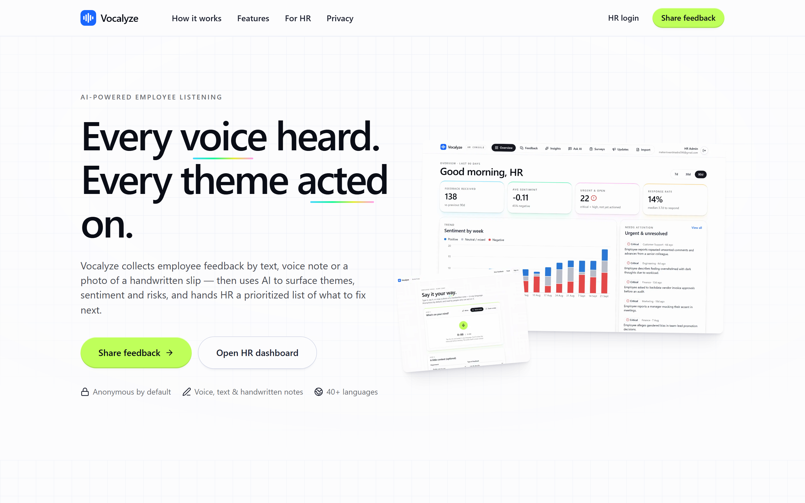 | 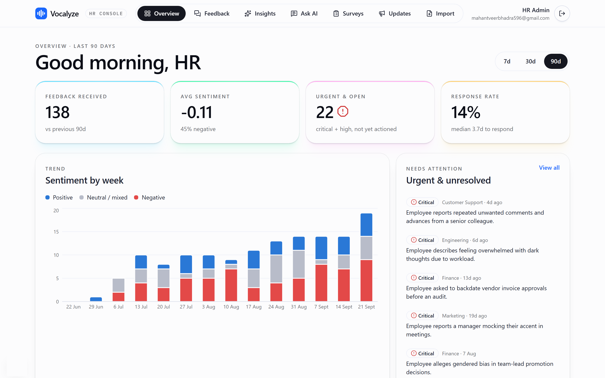 |
| *Modern blueprint-inspired landing page introducing the closed-loop system.* | *HR console with 90-day sentiment trends, volume KPIs, and urgent attention queues.* |

---

### 2. Feedback Inbox & AI Analysis
| Feedback Inbox | AI Analysis & Case Detail |
| :---: | :---: |
| 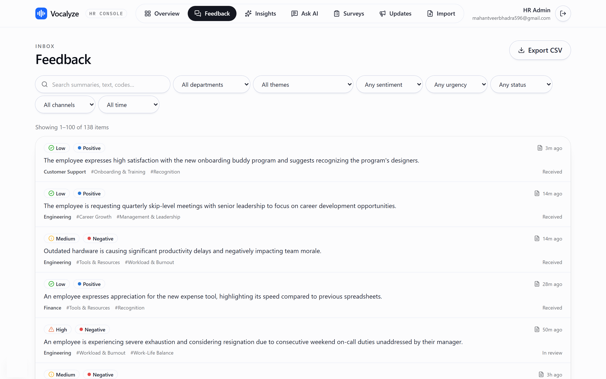 | 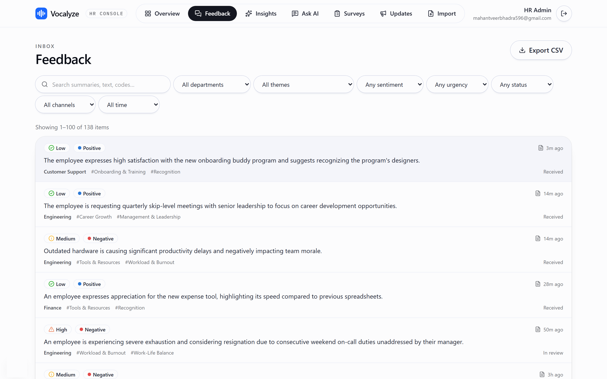 |
| *Searchable, filterable inbox with urgency tags, sentiment badges, and status tracking.* | *Automated PII redaction (`[NAME]`), emotion breakdown, risk flags, and suggested actions.* |

---

### 3. AI Insights & Natural Language RAG
| Executive AI Insight Briefing | Ask AI Grounded Q&A |
| :---: | :---: |
| 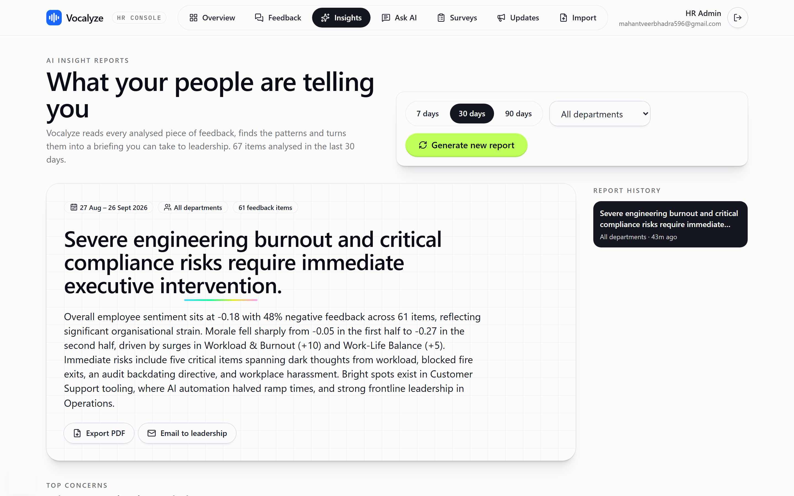 | 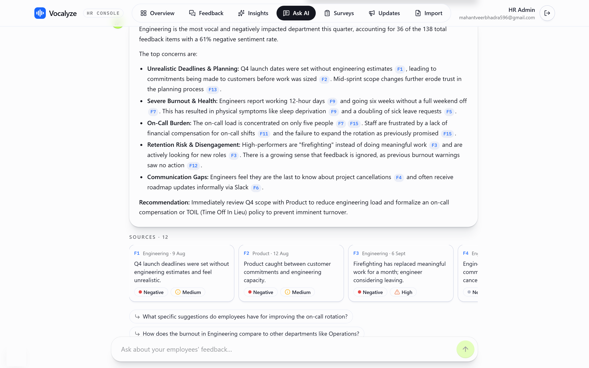 |
| *Leadership briefings with top concerns, evidence links, bright spots, and P1–P3 action plans.* | *Streamed semantic search across feedback citing specific evidence keys (`[F1]`, `[F2]`).* |

---

### 4. Employee Multimodal Submission
| Multimodal Input (Write / Voice / Scan) | In-Memory Voice Recording |
| :---: | :---: |
| 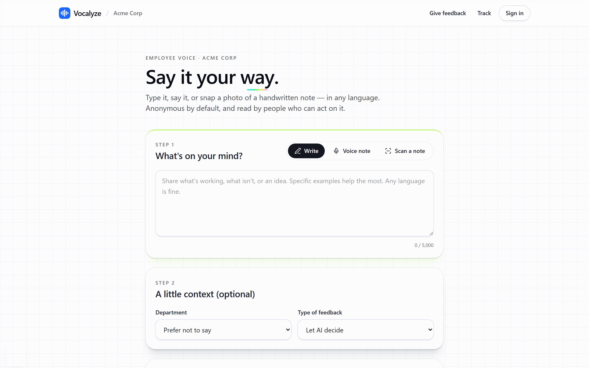 | 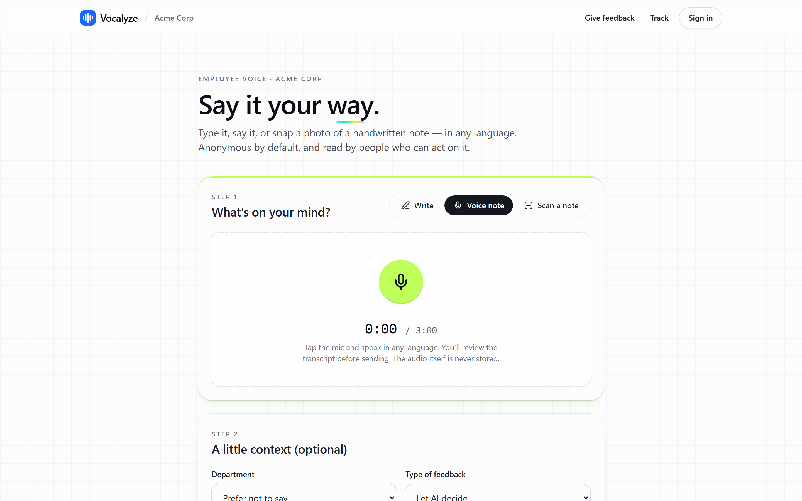 |
| *Submit feedback by text, voice note, or physical paper scan in any language.* | *Speech-to-text transcribed in memory; audio is never stored on disk or database.* |

---

### 5. Employee Portal & Wellbeing
| Employee Portal Home | Weekly Wellbeing Check-in ($k \ge 5$) |
| :---: | :---: |
| 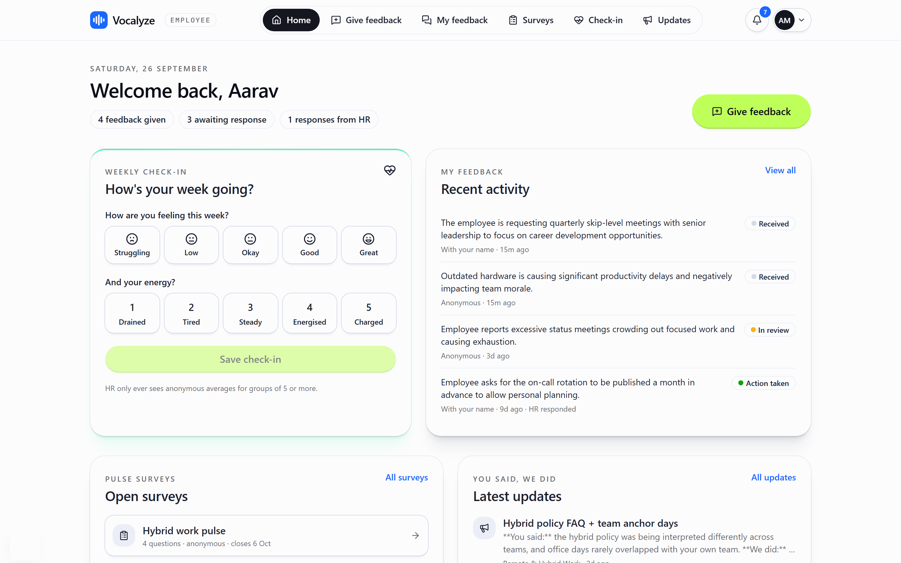 | 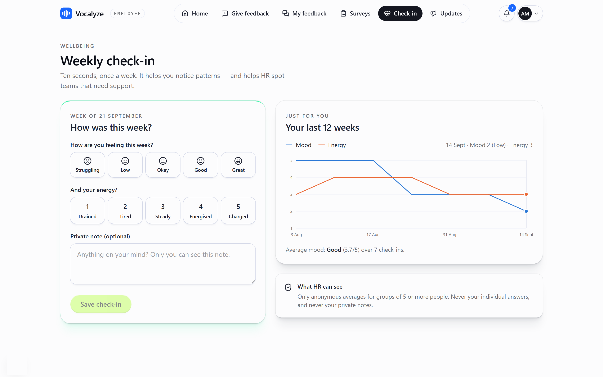 |
| *Personalized portal with tracking timeline, open surveys, check-in widget, and updates.* | *Weekly mood & energy tracker with mathematical k-anonymity guarantees.* |

---

### 6. Surveys & Closed-Loop Updates
| HR Pulse Survey Management | "You Said, We Did" Public Updates |
| :---: | :---: |
| 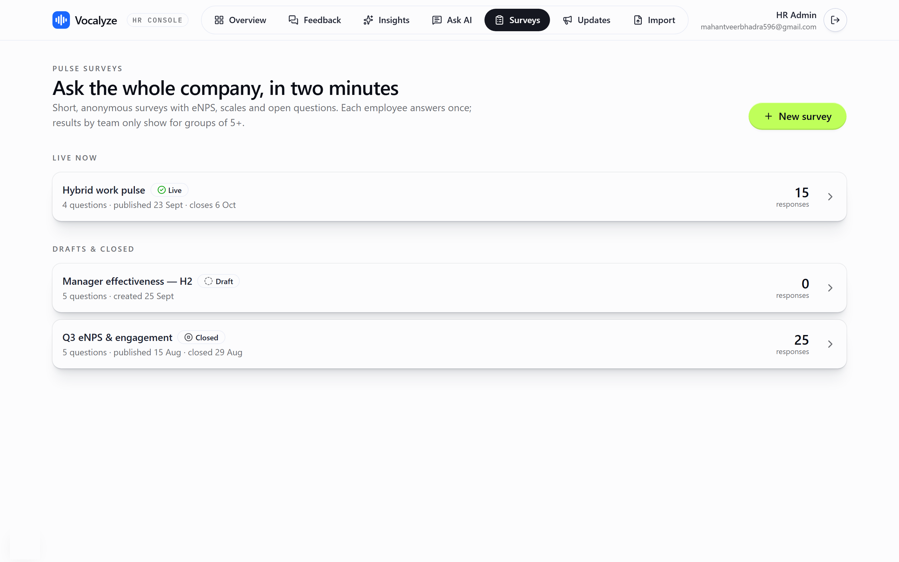 | 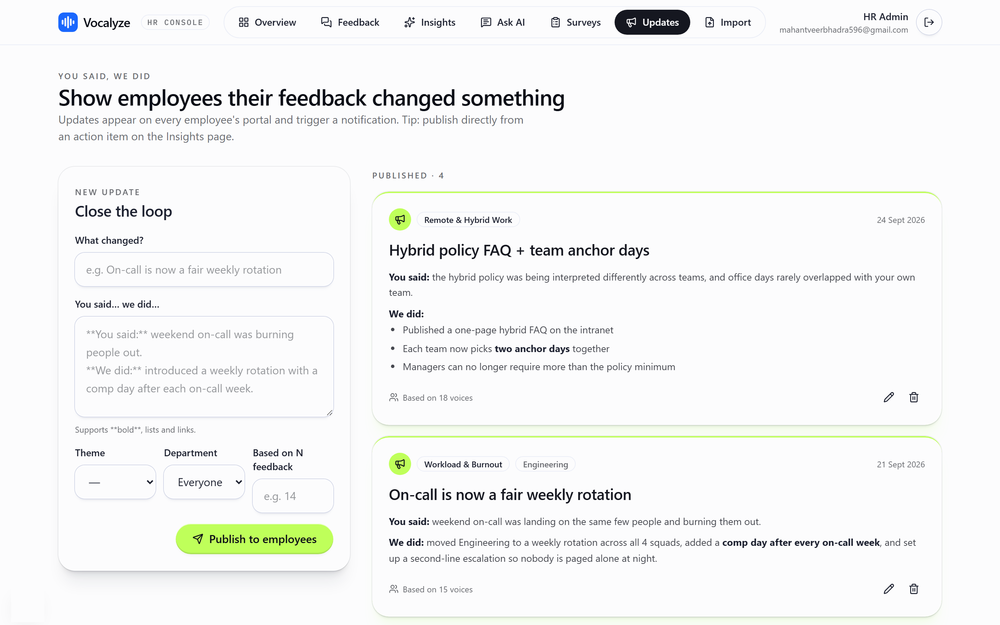 |
| *Pulse survey creation, response monitoring, and automated AI qualitative summarization.* | *Closing the feedback loop by publishing organizational actions linked to employee input.* |

---

## System Architecture

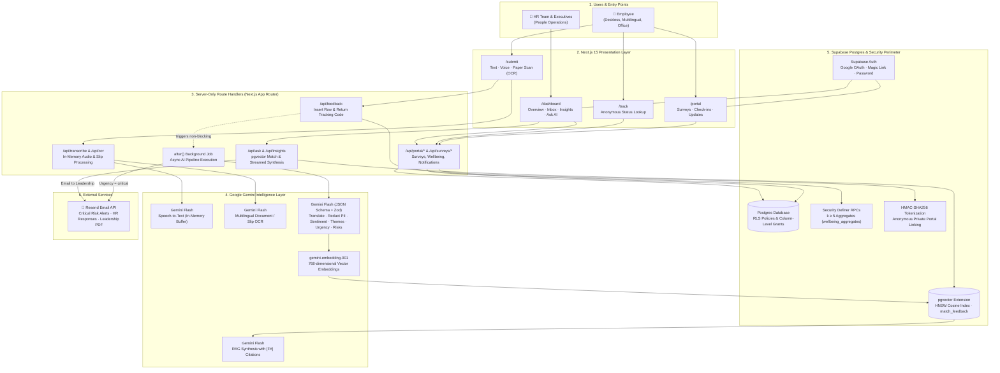

### Architecture Highlights
- **Server-Only Security:** All Gemini API keys, service role credentials, and HMAC signing secrets remain strictly on the server. The client browser never communicates directly with LLMs or privileged database tables.
- **Non-Blocking Ingestion (`after()`):** Submissions write the base record and return the tracking code immediately (<500ms). The intensive AI pipeline runs asynchronously via Next.js `after()`, eliminating employee wait times.
- **Deterministic AI Analysis:** Gemini structured outputs are bound to a strict JSON Schema validated with Zod, enforcing a fixed 15-theme taxonomy, standard emotion tags, and calibrated urgency ratings.
- **Fail-Safe Fallback Chain:** Model invocations implement exponential backoff and transparently fall back across Gemini variants (`gemini-flash-latest` $\to$ `gemini-3-flash-preview` $\to$ `gemini-2.5-flash-lite`) to safeguard against quota limits or temporary upstream outages.

---

## Privacy, Security & Responsible AI

| Principle | Implementation |
|---|---|
| **Database-Enforced Anonymity** | An absolute PostgreSQL `CHECK` constraint (`anonymous_has_no_identity`) rejects rows where `is_anonymous = true` contains a name, email, or user ID. |
| **Automatic PII Redaction** | Any entity (names, phone numbers, employee IDs, dates, specific locations) mentioned in feedback is sanitized to `[NAME]`, `[EMAIL]`, `[PHONE]`, etc. |
| **Zero Raw Data Retention** | Original verbatim text is scrubbed from the database for anonymous feedback immediately after AI extraction succeeds. Only the sanitized English version is retained for HR. |
| **In-Memory Audio Processing** | Voice notes are streamed directly to memory buffers (max 10 MB) for transcription and instantly garbage-collected. No audio files are ever written to disk or storage buckets. |
| **Pseudonymous Portal Linking** | Authenticated employees see their anonymous feedback in their private portal via a one-way `HMAC-SHA256(ANON_LINK_SECRET, user_id)` hash. Column-level permissions explicitly revoke HR from reading or querying `submitter_hash`. |
| **Mathematical $k$-Anonymity ($k \ge 5$)** | Wellbeing ratings are aggregated via the security-definer function `wellbeing_aggregates()`, which mathematically suppresses any team or week with fewer than 5 respondents. |
| **Prompt Injection Hardening** | In compliance with OWASP LLM01, untrusted submissions are wrapped in strict XML tags (`<feedback>...</feedback>`) with system instructions treating content strictly as passive data. |
| **Human in the Loop** | AI categorizes, prioritizes, and drafts suggestions; human HR administrators make all final operational, disciplinary, and communication decisions. |

---

## Fixed Taxonomies & Classifications

### 15 Standard Themes
Feedback is categorized into 1 to 3 items from an immutable corporate taxonomy:
1. `Workload & Burnout`
2. `Management & Leadership`
3. `Compensation & Benefits`
4. `Career Growth`
5. `Work-Life Balance`
6. `Team Culture`
7. `Communication`
8. `Tools & Resources`
9. `Recognition`
10. `Remote & Hybrid Work`
11. `Workplace Safety`
12. `Diversity & Inclusion`
13. `Onboarding & Training`
14. `Facilities`
15. `Other`

### 7 Critical Risk Flags
- `harassment` — Unwelcome conduct, bullying, or sexual harassment
- `discrimination` — Bias based on gender, race, age, religion, or background
- `safety` — Physical workplace hazards, blocked exits, unsafe machinery
- `burnout` — Severe chronic exhaustion, sleep deprivation, health impact
- `attrition_risk` — Explicit statements of intent to quit or job hunt
- `ethics` — Financial fraud, invoice tampering, regulatory compliance violations
- `mental_health` — Severe anxiety, depression, or self-harm warnings

### Urgency Levels
- `critical` — Harassment, safety, legal, ethics, or self-harm (triggers instant email alert to HR)
- `high` — Severe burnout, imminent resignation of key personnel, acute dysfunction
- `medium` — Recurring operational friction, tooling bottlenecks, policy confusion
- `low` — General suggestions, feature requests, minor observations, appreciation

---

## Tech Stack

| Layer | Technologies Used |
|---|---|
| **Frontend Framework** | [Next.js 15.5](https://nextjs.org/) (App Router, Server & Client Components) |
| **UI Library & Runtime** | [React 19.1](https://react.dev/), [TypeScript 5](https://www.typescriptlang.org/) |
| **Styling & Design System** | [Tailwind CSS v4](https://tailwindcss.com/), Lucide Icons, Sonner Notifications, Blueprint Grid Design System |
| **Data Visualization** | [Recharts](https://recharts.org/), Custom Semantic SVG Charts |
| **Database & Auth** | [Supabase](https://supabase.com/) (PostgreSQL 15+, Row-Level Security, Column-Level Privileges) |
| **Vector Engine** | [pgvector](https://github.com/pgvector/pgvector) (768-dimensional embeddings, HNSW Cosine Index) |
| **AI / Large Language Models** | [Google Gemini API](https://ai.google.dev/) (`gemini-flash-latest`, `gemini-embedding-001`, `@google/genai` SDK) |
| **Validation & Schemas** | [Zod 4](https://zod.dev/) with `zod-to-json-schema` |
| **Transactional Email** | [Resend](https://resend.com/) API |
| **Automated Testing & Tools** | [Vitest](https://vitest.dev/), [Playwright](https://playwright.dev/) (headless browser automation) |

---

## Project Structure

```text
sit-hc/
├── docs/
│   ├── DESIGN.md                 # Design tokens, color system, and blueprint styling rules
│   └── screenshots/              # High-resolution documentation screenshots
├── public/                       # Static public assets, wordmarks, icons
├── scripts/
│   ├── create-hr.mjs             # Bootstrap initial HR admin in Supabase Auth
│   ├── create-employee.mjs       # Bootstrap demo employee account
│   ├── create-dev-logins.mjs     # Bootstrap judge-facing dev accounts
│   ├── db.mjs                    # Database migration utility
│   ├── screenshots.ts            # Automated Playwright screenshot generator
│   ├── seed.ts                   # Seeds ~131 realistic multilingual feedback records + embeddings
│   └── seed-portal.ts            # Seeds pulse surveys, updates, check-ins, notifications
├── src/
│   ├── app/                      # Next.js 15 App Router pages & route handlers
│   │   ├── api/                  # Server-only REST & streaming API endpoints
│   │   │   ├── ask/              # RAG semantic search & streaming answer route
│   │   │   ├── feedback/         # Feedback ingestion, triage, notes, reprocessing
│   │   │   ├── insights/         # Executive AI report generation & email dispatch
│   │   │   ├── ocr/              # Slip & document vision OCR
│   │   │   ├── portal/           # Employee portal check-ins, notifications, feedback
│   │   │   ├── surveys/          # Pulse surveys CRUD, response ingestion, AI summary
│   │   │   ├── track/            # Public anonymous status lookup
│   │   │   ├── transcribe/       # In-memory audio transcription
│   │   │   ├── updates/          # "You said, we did" updates
│   │   │   └── wellbeing/        # k-anonymity aggregate endpoint
│   │   ├── dashboard/            # HR Console (Overview, Inbox, Insights, Ask AI, Surveys)
│   │   ├── login/                # Authentication page (Google OAuth & Password)
│   │   ├── portal/               # Employee private dashboard
│   │   ├── submit/               # Employee feedback submission form
│   │   ├── track/                # Anonymous feedback tracking status page
│   │   ├── globals.css           # Tailwind v4 theme variables and blueprint grid
│   │   ├── layout.tsx            # Root layout with IBM Plex fonts and Sonner toast
│   │   └── page.tsx              # Public landing page
│   ├── components/               # Modular React UI components
│   │   ├── ask/                  # RAG chat UI with inline citations & sources
│   │   ├── dashboard/            # Metrics cards, risk radars, charts, heatmap
│   │   ├── feedback/             # Feedback lists, filters, detail drawer, triage
│   │   ├── insights/             # Report viewer, PDF export, concern cards
│   │   ├── landing/              # Landing hero, feature highlights, footer
│   │   ├── portal/               # Employee portal widgets, surveys, check-in
│   │   ├── submit/               # Multimodal forms (text, audio recorder, OCR dropzone)
│   │   ├── ui/                   # Reusable base primitives (Card, Button, Badge)
│   │   └── wellbeing/            # k-anonymity TrendChart with collision prevention
│   └── lib/                      # Core business logic, database, and AI integrations
│       ├── ai/                   # Gemini client, prompt engineering, structured schemas, RAG
│       ├── supabase/             # Server, client, and admin Supabase factory helpers
│       ├── types.ts              # Core TypeScript interfaces, taxonomies, and enums
│       └── utils.ts              # Formatting utilities, HMAC hashing, date helpers
├── supabase/
│   └── migrations/
│       ├── 0001_init.sql         # Base tables, pgvector, RLS, matching RPC
│       └── 0002_employee_portal.sql # Portal tables, HMAC indexes, k>=5 aggregates RPC
├── package.json                  # Dependencies, scripts, and build configuration
└── tsconfig.json                 # TypeScript compiler configuration
```

---

## Installation & Setup

### Prerequisites
- [Node.js](https://nodejs.org/) v20.x or higher
- [npm](https://www.npmjs.com/) v10.x or higher
- A [Supabase](https://supabase.com/) project (with pgvector enabled)
- A [Google AI Studio](https://aistudio.google.com/app/apikey) API Key (Gemini)
- A [Resend](https://resend.com/) API Key (for transactional alert emails)

### 1. Clone Repository & Install Dependencies
```bash
git clone https://github.com/VeerbhadraMahant/sit-hc.git
cd sit-hc
npm install
```

### 2. Configure Environment Variables
Copy the template file to `.env.local`:
```bash
cp .env.example .env.local
```
Open `.env.local` and populate the required credentials:
```env
# ── Google Gemini (Required) ──────────────────────────────────
GEMINI_API_KEY=your-gemini-api-key
GEMINI_MODEL=gemini-flash-latest
GEMINI_EMBED_MODEL=gemini-embedding-001

# ── Supabase Database & Auth (Required) ───────────────────────
NEXT_PUBLIC_SUPABASE_URL=https://your-project-ref.supabase.co
NEXT_PUBLIC_SUPABASE_ANON_KEY=your-anon-or-publishable-key
SUPABASE_SERVICE_ROLE_KEY=your-service-role-secret-key

# ── Resend Email (Required for alerts & reports) ───────────────
RESEND_API_KEY=re_your-resend-key
EMAIL_FROM="Vocalyze <onboarding@resend.dev>"
HR_ALERT_EMAIL=hr@yourcompany.com

# ── Cryptographic Salt for Anonymous Linking ──────────────────
# Generate with: openssl rand -hex 32
ANON_LINK_SECRET=your-random-32-byte-hex-secret

# ── Application URL ───────────────────────────────────────────
NEXT_PUBLIC_APP_URL=http://localhost:3000
NEXT_PUBLIC_ORG_NAME="Acme Corp"

# ── Default Bootstrap Logins ──────────────────────────────────
HR_ADMIN_EMAIL=hr@yourcompany.com
HR_ADMIN_PASSWORD=your-secure-password
HR_ADMIN_NAME="Priya Sharma"

DEMO_EMPLOYEE_EMAIL=employee@yourcompany.com
DEMO_EMPLOYEE_PASSWORD=your-secure-password
```

### 3. Initialize Database Migrations
Apply the initial SQL schemas and security policies directly to your Supabase project:
```bash
# Execute schema migration 1 (Base tables, pgvector, RLS, matching functions)
npm run db -- --file supabase/migrations/0001_init.sql

# Execute schema migration 2 (Portal, check-ins, surveys, k>=5 aggregates)
npm run db -- --file supabase/migrations/0002_employee_portal.sql
```
*(Alternatively, copy and paste both files into the Supabase Web SQL Editor).*

### 4. Bootstrap Administrative Users & Seed Demo Data
```bash
# Create the initial HR administrator account in Supabase Auth
npm run create-hr

# Create the demo employee account for portal testing
npm run create-employee

# Seed ~131 realistic multilingual feedback entries and vector embeddings
npm run seed -- --reset

# Seed portal surveys, check-ins, and company updates
npm run seed:portal
```

### 5. Start Local Development Server
```bash
npm run dev
```
Open [http://localhost:3000](http://localhost:3000) in your browser to view the application.

---

## Route Map

| Route | Audience | Description |
|---|---|---|
| `/` | Public | Product landing page highlighting features, architecture, and privacy guarantees. |
| `/submit` | Public / Employee | Multimodal feedback form supporting write, voice note recording, and paper slip OCR. |
| `/track` | Public / Employee | Anonymous tracking page to check review status and read HR responses via tracking code. |
| `/login` | Public / Users | Unified login supporting email/password and Google OAuth. |
| `/portal` | Employee | Authenticated employee portal with personal feedback history, surveys, and check-ins. |
| `/portal/surveys` | Employee | Take active pulse surveys with scales, eNPS, and open text. |
| `/portal/checkin` | Employee | Weekly mood and energy check-in ($k \ge 5$ anonymous). |
| `/portal/updates` | Employee | "You said, we did" organizational response board. |
| `/dashboard` | HR (Protected) | Main HR overview console with KPIs, sentiment curves, and risk radars. |
| `/dashboard/feedback` | HR (Protected) | Real-time feedback inbox, filtering, CSV export, and triage workflow. |
| `/dashboard/insights` | HR (Protected) | Executive AI briefing generator with PDF export and email dispatch. |
| `/dashboard/ask` | HR (Protected) | Semantic RAG Q&A interface with source citations. |
| `/dashboard/surveys` | HR (Protected) | Pulse survey management, live response tracking, and AI summary. |
| `/dashboard/updates` | HR (Protected) | Create and publish "You said, we did" updates. |
| `/dashboard/import` | HR (Protected) | Bulk import scanned paper cards or paste raw CSV data. |

---

## Backend API Reference

### Feedback & Ingestion
| Method | Endpoint | Description |
|---|---|---|
| `POST` | `/api/feedback` | Submit feedback (text, voice, or OCR). Returns tracking code immediately and initiates background analysis. |
| `GET` | `/api/feedback/[id]` | Fetch single feedback row with analysis breakdown (HR only). |
| `PATCH` | `/api/feedback/[id]` | Update feedback status (`in_review`, `actioned`, `closed`) or submit an HR response. |
| `POST` | `/api/feedback/[id]/notes` | Create an internal HR case note (HR only; hidden from employees). |
| `POST` | `/api/feedback/[id]/reprocess` | Force re-execution of the AI analysis and embedding pipeline for an item. |
| `GET` | `/api/track/[code]` | Public endpoint returning status timeline and HR response for a tracking code. |
| `GET` | `/api/export` | Export feedback rows matching current filters to CSV format. |
| `POST` | `/api/import` | Bulk ingest suggestion slips or CSV data (HR only). |

### Multimodal Media Processing
| Method | Endpoint | Description |
|---|---|---|
| `POST` | `/api/transcribe` | Transcribes an audio memory buffer (WebM/WAV) using Gemini Flash. Audio is never stored. |
| `POST` | `/api/ocr` | Extracts text from scanned image/PDF slips and detects departments using Gemini Vision. |

### AI Synthesis & Retrieval
| Method | Endpoint | Description |
|---|---|---|
| `POST` | `/api/ask` | Streams semantic RAG answers with `[F#]` citations using vector similarity search. |
| `POST` | `/api/insights` | Generates a cached executive report with top concerns, bright spots, and P1–P3 action items. |
| `POST` | `/api/insights/[id]/email` | Dispatches the executive report to company leadership via Resend. |

### Employee Portal & Surveys
| Method | Endpoint | Description |
|---|---|---|
| `GET` | `/api/portal/my-feedback` | Fetches feedback history linked to the authenticated employee (pseudonymously via HMAC). |
| `POST` | `/api/portal/checkin` | Submits weekly mood & energy rating for the employee. |
| `GET` | `/api/portal/notifications` | Retrieves system, survey, and feedback status notifications. |
| `GET` | `/api/surveys` | Lists active and draft pulse surveys. |
| `POST` | `/api/surveys` | Creates a new pulse survey with scale, choice, and text questions. |
| `POST` | `/api/surveys/[id]/respond` | Records a survey response with a cryptographically hashed respondent ID. |
| `GET` | `/api/surveys/[id]/summary` | Generates an AI qualitative synthesis of all open-ended survey comments. |
| `GET` | `/api/wellbeing` | Executes `wellbeing_aggregates()` RPC returning org-wide metrics for groups of $k \ge 5$. |
| `GET` / `POST` | `/api/updates` | Manages public "You said, we did" organizational broadcast updates. |

---

## Data Flow & Analysis Pipeline

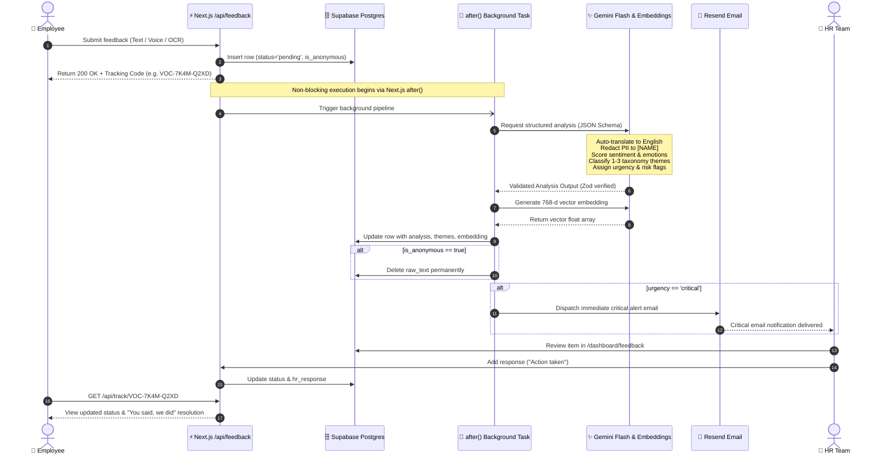

---

## Verification & Quality Assurance

The codebase includes automated unit testing, type checking, and linting suites:

```bash
# Run TypeScript compilation check
npm run typecheck

# Execute unit test suites (schemas, AI survey aggregation)
npm run test

# Run ESLint validation
npm run lint

# Capture automated Playwright screenshots of running application
npm run screenshots
```

---

## Deployment

### Vercel (Recommended)
1. Push repository to GitHub.
2. Import project into [Vercel](https://vercel.com/).
3. Add all environment variables defined in `.env.example` to the Vercel Project Settings.
4. Set the `NEXT_PUBLIC_APP_URL` to your production domain (e.g., `https://vocalyze.yourcompany.com`).
5. Deploy.

### Supabase Production Readiness
- Ensure database connections use connection pooling (Transaction mode, port 6543) for serverless environments.
- Verify OAuth callback URLs include `https://<your-vercel-domain>/auth/v1/callback`.
- Verify your sender domain in [Resend](https://resend.com/domains) and update `EMAIL_FROM` to an authenticated corporate address (e.g., `Vocalyze <feedback@yourcompany.com>`).

---

## Known Limitations

- **Email Delivery in Sandbox:** When using the unverified default Resend sandbox (`onboarding@resend.dev`), alert emails can only be delivered to the verified account owner's email address. Domain verification in Resend is required for arbitrary recipient delivery.
- **Audio File Size:** Direct browser audio recording and memory upload are capped at 10 MB per voice note to maintain fast in-memory transcription and avoid serverless memory exhaustion.
- **$k$-Anonymity Data Thresholds:** Teams or departments with fewer than 5 active check-ins during a given week are intentionally suppressed from HR wellbeing charts to guarantee statistical anonymity.

---

## Roadmap

- [ ] **WhatsApp & IVR Voice Intake:** Two-way voice and messaging hotline enabling factory and field staff without smartphones to submit feedback via phone call or WhatsApp message.
- [ ] **Factory Floor Kiosk Mode:** Touchscreen kiosk interface designed for shared tablet terminals in breakrooms with session auto-reset and zero cached data.
- [ ] **HRIS Integrations:** Native connectors for enterprise HR systems including Workday, Darwinbox, and Zoho People for automated organizational hierarchy mapping.
- [ ] **Predictive Attrition Forecasting:** Multi-week aggregate trend analysis identifying turnover indicators before resignations occur.
